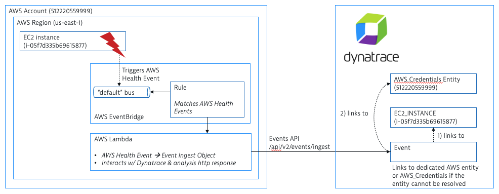

Solution brief
 
# Goal
The goal is to forward out-of-the-box health events from the hyperscaler environments directly to Dynatrace, creating associated Dynatrace events. These events are rich enough to associate them with the Dynatrace entities, e.g., an AWS EC2-related event becomes a problem event in Dynatrace linked with the Dynatrace EC2 instance representation.
 
The solution uses the public Dynatrace APIs and requires no cluster code changes. Customers can install the integrations by following a hyperscaler specific guide or executing an installation script. This repository hosts the AWS implementation. The Azure implementation is available at https://github.com/dynatrace-oss/azure-platform-health-integration.
 
# AWS implementation

For any AWS account, account-specific health information gets automatically published to EventBridge. Simple rules define which events are forwarded to downstream processing. These rules need to be configured per AWS region.

A rule matching an out-of-the-box AWS health event gets forwards to a custom-built AWS lambda. First, the AWS Lamba transforms the original AWS health event into a Dynatrace event object. Then, the event object is forwarded to Dynatrace, making a direct API call to Dynatrace.

# Testing
Prior running tests, load a dedicated shell environment. Adapt the envs/local_example.source accordingly. Activate by running `source envs/local_example.source`. Install all development dependencies by executing `npm install --include=dev` and run all tests with `npm run test`. Do so from the folder `awshealth2dynatrace/awsHealthEvent2DTEventFunction`. When running the tests, unit tests are executed but also example health events are created. These are stored according to your configuration in `source envs/local_example.source`. As part of the test procedure the example health events are transformed and each transformation result is stored in a dedicated file. By running `node index.js /tmp/AWSHealthEvent1_fullEventBridgeMessage.json` you can run the transformation steps locally and directly send data to your Dynatrace tenant. Using `./test/manual/sendAWSHealthEvent.sh /tmp/AWSHealthEvent1_toEventBridgeThroughAPI.json` you can send an example health event to an AWS EventBridge bus using the AWS api. You can also copy/ paste `/tmp/AWSHealthEvent1_toEventBridgeManualDump.json` to the AWS EventBridge console and trigger the UI manually. Finally you can also send a transformed event directly to the Dynatrace API, by calling `./test/manual/sendDTEventIngestRequest.sh AWSHealthEvent1_toDynatraceThroughAPI.json`.

# Deploying to AWS environment
First, configure your environment variables, according to the sample in `envs/sam_test.txt`. 2nd, run the AWS SAM command `sam deploy --parameter-overrides $(cat envs/sam_test.txt) --stack-name awshealth2dynatrace --guided`, which guides you through the final configuration.

Once the SAM deploy process is finished, all assets are deployed. As documented in the Testing section, use `./test/manual/sendAWSHealthEvent.sh /tmp/AWSHealthEvent1_toEventBridgeThroughAPI.json` to test your installation.